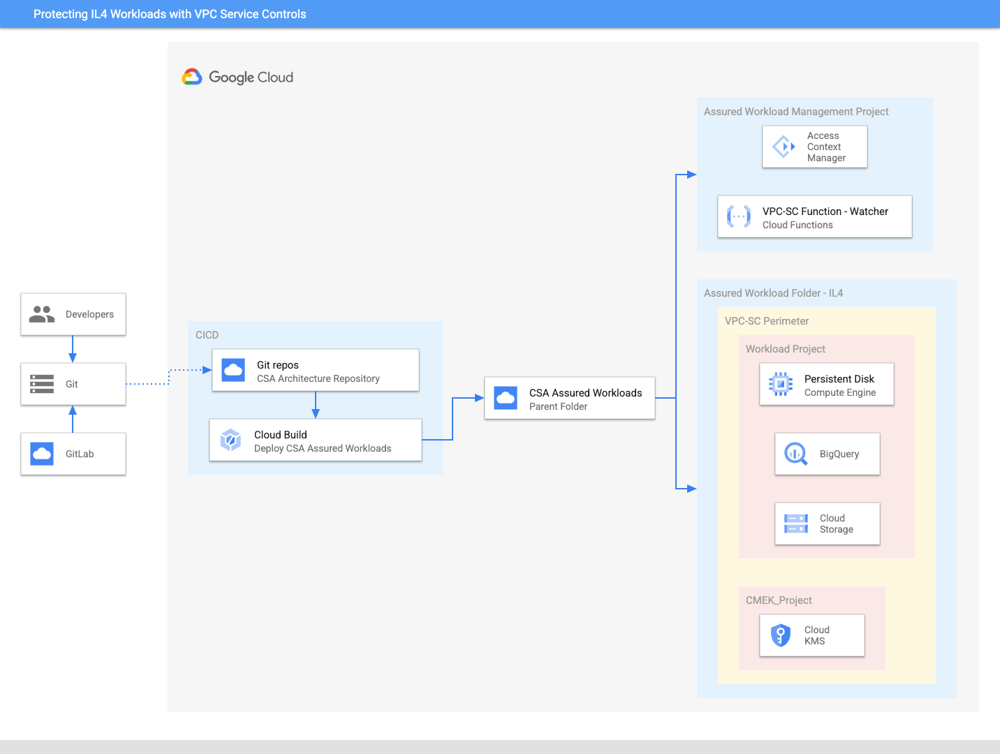

```
This is not an officially supported Google product.
This code creates PoC demo environment for CSA IL4 Assured Workload with VPC service perimeter. This demo code is not built for production workload. 
```

# Compliance in Australia with Assured Workloads Architecture Guide

# Summary

Assured Workloads helps you comply with different regulatory compliance frameworks by implementing logical controls that segment networks and users from in-scope sensitive data. Many of the US compliance frameworks are built upon NIST SP 800-53 Rev. 5, but add on controls based on the sensitivity of the information and the framework's governing body. 

This guide will provide written instructions and Terraform/Python code for creating an Assured Workloads folder for a FedRAMP Moderate compliance framework

# Architecture 

## Design Diagram



## Product and services

[Assured Workloads](https://cloud.google.com/assured-workloads) provides Google Cloud customers with the ability to apply security controls to an environment  in support of compliance requirements without compromising the quality of their cloud experience. Australia Regions with Assured Support enforces data residency for customer data at-rest to our two cloud regions in Australia (Sydney and Melbourne). It’s coupled with our new Assured Support service, which means that customer support will be provided from only five countries (United States, Australia, Canada, New Zealand, and the United Kingdom). 

Before proceeding with this guide, you should:

-  Ensure that the Google Cloud services you are planning to use are [in scope for Australia Regions with Assured Support](https://cloud.google.com/assured-workloads/docs/supported-products)

## Design considerations

Assured Workloads folders modify Google Cloud's inherent global infrastructure to deliver products and services with FedRAMP High compliance requirements by adjusting Google Cloud products' global behavior and access paths. This includes disabling global APIs, including the products' underlying dependencies, to provide data residency. Customers are still responsible for configuring IAM permissions, networking, and GCP services to meet their compliance requirements.

## Prerequisites

### Assured Workloads

Before proceeding, it is important to understand that Asutralia Regions with Assured Support is a [Premium Platform Control.](https://cloud.google.com/assured-workloads/docs/concept-platform-controls#premium_tier) Platform Controls are a combination of Google Cloud infrastructure data location and personnel access primitives that support compliance by enforcing and restricting access by customers or Google personnel. To launch a Premium Platform Control, you must:

-  Ensure you have [Enhanced or Premium Support ](https://cloud.google.com/support)
-  [Enable Access Transparency](https://cloud.google.com/cloud-provider-access-management/access-transparency/docs/enable)

If you wish to use Assured Workloads [Premium Platform Controls](https://cloud.google.com/assured-workloads/docs/concept-platform-controls#premium_tier) but don't currently have a Premium subscription, sign up for a 60-day [Premium Free Trial](https://inthecloud.withgoogle.com/assured-workloads-60-day-trial-interest/sign-up.html?_gl=1*1q0ww8q*_ga*MTk5NjYyOTEzMi4xNjc5NDMzMTky*_ga_WH2QY8WWF5*MTY3OTUwODI5OC40LjEuMTY3OTUwODMyNy4wLjAuMA..&_ga=2.182814626.58027757.1679433192-1996629132.1679433192). 

Many Google Cloud services send out notifications to share important information with Google Cloud users. With [Essential Contacts](https://cloud.google.com/resource-manager/docs/managing-notification-contacts), you can customize who receives notifications by providing your own list of contacts. This is important because different individuals and teams within your organization care about different types of notifications. To reduce the impact of personnel changes, we recommend adding groups as contacts, then managing the membership of those groups to determine who receives notifications. This practice helps ensure that notifications always go to active employees.

1. Enable the [Essential Contacts API](https://console.cloud.google.com/flows/enableapi?apiid=essentialcontacts.googleapis.com&_ga=2.178924196.1685767107.1678727190-215554569.1678472440)
1. Visit the [Essential Contacts page](https://console.cloud.google.com/iam-admin/essential-contacts?_ga=2.217834006.1685767107.1678727190-215554569.1678472440)
1. Ensure the Google Cloud Organization is selected
1. [Add an Essential Contact](https://cloud.google.com/resource-manager/docs/managing-notification-contacts#add) for **Legal**

We recommend adding three Contacts for the Legal category: representatives from your Legal, Compliance, and Security departments. **This group will receive notifications of compliance violations**, so this will ensure that Legal and Compliance remain informed, and acts as an immediate notification to Security for remediation actions. We also recommend that you enact a plan of action for addressing these alerts.

# Deployment

## Terraform Deployment Instructions
Sign in to your organization and assign yourself the following roles: 
1. Access Transparency Admin: roles/axt.admin
2. Assured Workloads Admin: roles/assuredworkloads.admin
3. Resource Manager Organization Viewer: roles/resourcemanager.organizationViewer

The following steps should be executed in Cloud Shell in the Google Cloud Console.

1. To deploy the architecture open up Cloud shell and clone the [git repository](https://github.com/Urena-luis/assured-workloads) using the command below.

```
git clone https://github.com/Urena-Luis/assured-workloads
```

1. Navigate to the csa-il4-assured-workload folder.

```
cd csa-il4-assured-workload
```

1. In the csa-il4-assured-workload folder navigate to variable.tf file and update variables organization_id, billing_account and members for access in assured workload.

```
organization_id = "XXXXXXXXXXX"

billing_account = "XXXX-XXXXXX-XXXXX"

Members = ["user:name@domain.com"]
```

> Note: All the other variables are given a default value. If you wish to change, update the corresponding variables in the variable.tf file.

1. To find your organization id and billing_id, run the following command.

```
gcloud projects get-ancestors [ANY_PROJECT_ID_IN_ORG]

gcloud alpha billing accounts list
```

1. While in the csa-il4-assured-workload, run the commands below in order. When prompted for confirmation enter "yes" to proceed.

```
terraform init

terraform apply -target=data.google_projects.in_perimeter_folder

terraform apply
```

> If prompted, authorize the API call.

1. Once deployment is finished it will publish the output summary of assets orchestrated. It deploys the resources within 10 minutes.

1.  After completing the demo, navigate to the csa-il4-assured-workload folder and run the command below to destroy all resources.

```
 terraform destroy
 ```

# Best Practices

We recommend you familiarize yourself with Google Cloud's recommended process to configure and enforce VPC-SC protection in your Google Cloud organization [by reading this document.](https://cloud.google.com/vpc-service-controls/docs/enable) Careless enablement of VPC-SC can cause problems with existing applications and can cause an outage. 

We also strongly recommend that you do not nest an Assured Workloads folder within another Assured Workloads folder - even if they are the same compliance framework - as this will cause errors. You can, however, nest Assured Workloads folders and non-Assured Workloads folders with each other.

We also recommend you set up logging and alerts for any changes to the Assured Workloads folder or according IAM permissions, including Org Admin changes. These alerts should be routed to an appropriate stakeholder other than Org Admin. This is because Org Admin can change the org level policies that are important for continuing compliance.

# Governance, Risk Management, and Compliance

## Discover Compliance Violations

Assured Workloads monitors a compliance framework's [organization policy constraints](https://cloud.google.com/resource-manager/docs/organization-policy/org-policy-constraints), and highlights a violation if a change to a resource is non-compliant. You can then resolve these violations, or create exceptions for them where appropriate.

Monitor the organization policy constraints, and highlight violations if a change to a resource is non-compliant. Violations may be viewed by navigating to the Assured Workloads [Monitoring page](https://console.cloud.google.com/compliance/monitoring?_ga=2.26184249.524481087.1680725155-1422847751.1680725155) and clicking the **Violation ID **to view the status of your compliance violations

Act and remediate these violations by following the remediation steps in the **Violation Details. **Please visit this [page](https://cloud.google.com/assured-workloads/docs/monitor-folder#monitored_violations) for the complete list of Monitored Violations. 

## Exceptions to the Restrict Resource Usage Organization Policy

We recommend maintaining Organization Policy Restrictions in place, as they help restrict access to unauthorized services and regions. However, you may selectively disable restrictions that prevent the usage of resources that aren't compliant with certain  compliance frameworks. **This is not recommended because it makes the Assured Workloads folder less restrictive and puts your environment in non-compliant scope**. However, it is available to customers who accept the risk of using non-compliant products. Customers may proceed with this by:

-  Having the appropriate IAM roles:
    -  Org Policy Administrator: roles/orgpolicy.policyAdmin
    -  Assured Workloads Admin: roles/assuredworkloads.admin

-  Modifying the policy based on [these instructions](https://cloud.google.com/resource-manager/docs/organization-policy/restricting-resources#setting_the_organization_policy)
-  [Adding an Assured Workloads Monitoring Violation Exception](https://cloud.google.com/assured-workloads/docs/monitor-folder#exception) to ensure the change has a documented business justification and isn't reported as "Unresolved" 

For an introduction on Organization Policy Restrictions, please [watch this video](https://www.youtube.com/watch?v=VX7444hVsD0). For more information on Restriction Resource Usage for Assured Workloads, including limitations, please read this [guide](https://cloud.google.com/assured-workloads/docs/restrict-resource-usage).

## Restrict TLS Versions

Google Cloud supports multiple TLS protocol versions. To meet compliance requirements, you may want to deny handshake requests from clients that use older TLS versions.

-  Ensure you have the appropriate IAM role:
    -  Org Policy Administrator: roles/orgpolicy.policyAdmin

-  Follow this [guide to restrict certain TLS versions ](https://cloud.google.com/assured-workloads/docs/restrict-tls-versions#restrict)

# Cost

<table>
  <thead>
    <tr>
      <th><strong>GCP Service</strong></th>
      <th><strong>Type</strong></th>
      <th><strong>Total Cost  USD </strong></th>
    </tr>
  </thead>
  <tbody>
    <tr>
      <td>Assured Workloads </td>
      <td>Premium Subscription, IL4</td>
      <td>20% uplift based on spend within the Assured Workloads folder</td>
    </tr>
    <tr>
      <td>VPC Service Controls</td>
      <td></td>
      <td>Free</td>
    </tr>
  </tbody>
</table>

The cost estimate may change with time and may vary per region, please review the cost of each resource at [Google Cloud Pricing Calculator](https://cloud.google.com/products/calculator).

# Related Resources

-  [Assured Workloads Quick Start Guide](https://services.google.com/fh/files/misc/assured_workloads_quick_start_guide_0423.pdf)
-  [Australia Regions with Assured Support Information](https://cloud.google.com/assured-workloads/docs/compliance-programs#aus-regions-support)
-  [Personnel Data Access Controls](https://cloud.google.com/assured-workloads/docs/personnel-access-data-controls)
-  [Control Data Access using Access Approval](https://cloud.google.com/assured-workloads/docs/access-approval)
-  [Supported Products](https://cloud.google.com/assured-workloads/docs/supported-products)
# 


#Remove the below:
# CSA Guide
This Cloud Security Architecture uses terraform to setup IL4 Assured Workload with VPC service perimeter demo in a parent folder and underlying infrastructure using Google Cloud Services like [Assured Workload](https://cloud.google.com/assured-workloads), [Cloud Function](https://cloud.google.com/functions), [Access Context Manager](https://cloud.google.com/access-context-manager), [Cloud Key Management](https://cloud.google.com/security-key-management), [Compute Engine](https://cloud.google.com/compute), [BigQuery](https://cloud.google.com/bigquery), [Compute Storage](https://cloud.google.com/storage)  and [Cloud Logging](https://cloud.google.com/logging).


## CSA Architecture Diagram
The image below describes the architecture of IL4 Assured Workload with VPC service perimeter.


## What resources are created?
Main resources:
- A parent folder for the PoC demo
- A management folder to manage assured workload APIs and VPC-SC perimeter
- IL4 Assured Workload
- One sub-project for the workload (Compute, Storage and BigQuery)
- One sub-project for KMS key


## How to deploy?
The following steps should be executed in Cloud Shell in the Google Cloud Console. 

### 1. Get the code
Clone this github repository go to the root of the repository.

``` 
git clone http://github.com/googlecloudplatform/csa-il4-assured-workload
cd csa-il4-assured-workload
```

### 3. Deploy the infrastructure using Terraform

From the csa-il4-assured-workload folder navigate to variable.tf file and update variables organization_id, billing_account and members for access in assured workload:

```
organization_id = “XXXXXXXXXXX”
billing_account = “XXXX-XXXXXX-XXXXX”
Members = [“user:name@domain.com”]
```


To find your  organization id and billing_id, run the following command: 
```
gcloud projects get-ancestors [ANY_PROJECT_ID_IN_ORG]
gcloud alpha billing accounts list
```

While in the csa-il4-assured-workload, run the commands below in order. When prompted for confirmation enter “yes” to proceed.
```
terraform init
terraform apply -target=data.google_projects.in_perimeter_folder
terraform apply
```
If prompted, authorize the API call.

**Note:** All the other variables are give a default value. If you wish to change, update the corresponding variables in variable.tf file.


## How to clean-up?

From the root folder of this repo, run the following command:
```
terraform destroy
```


